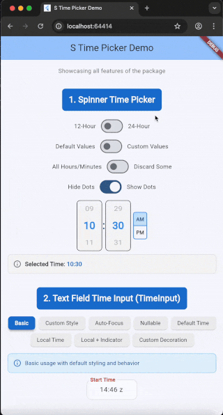

# s_time Example App

A comprehensive example application showcasing all features of the **s_time** package.

## Features Demonstrated

### 1. TimeSpinner Widget
- 12-hour and 24-hour format toggling
- Default vs custom hour/minute values
- Discarding specific hours/minutes
- No-selection dots toggle
- Real-time time selection

### 2. TimeInput Widget
Multiple examples showcasing different use cases:
- **Basic**: Simple time input with default behavior
- **Custom Style**: Styled input with custom colors and padding
- **Auto-Focus**: Input that auto-focuses with cursor selection
- **Nullable**: Optional time that can be cleared
- **Default Time**: Fallback time for invalid input
- **Local Time**: Use local time instead of UTC
- **Custom Decoration**: Fully customized input decoration

### 3. Features & Interactions
Visual showcase of package capabilities:
- Double-tap spinner for keyboard editing
- Enter key to submit
- Escape key to cancel
- Smart auto-formatting (1030 → 10:30)
- Smart cursor positioning
- Real-time validation
- Infinite scroll wheels
- Extensive customization

## Running the App

```bash
cd example
flutter run
```

## Screenshots



The example app includes interactive toggles and buttons to explore all variations and features of both widgets in real-time.

## Exploring the Code

The main code is in `lib/main.dart` which includes:
- Multiple TimeSpinner configurations
- Seven different TimeInput examples
- Interactive state management
- Custom styling examples
- Features showcase section

